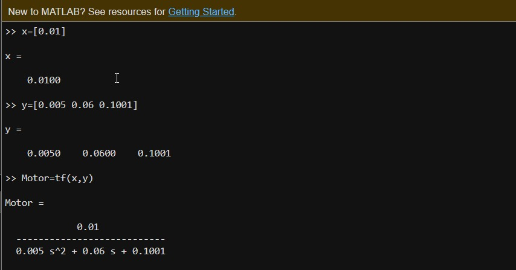

Design & Simulation for Auto Speed Control
This section details the design and simulation process for the Auto Speed Control system. Each step is explained, including the tools, methods, data, and results used during the simulation phase.

### Table of Contents
1. Design Approach
2. Simulation Setup
3. Steps and Methodology
  - Step 1: System Requirements
  - Step 2: Modeling
  - Step 3: Testing and Results
4. Root Locus and Transfer Function
5. Conclusion

## Design Approach
- Software Tools: MATLAB/Simulink was used for system modeling and simulation.
- Control Strategy: Proportional-Integral-Derivative (PID) control logic was implemented to ensure smooth speed regulation.
- Inputs/Outputs: The system takes current speed, max speed limit (road limit), and real-time IR sensor as inputs and adjusts throttle control as the output.

## Simulation Setup
- Platform: MATLAB/Simulink
- Simulation Type: Closed-loop control simulation
- Scenarios Simulated:
  - Straight road with varying speed limits
  - Triggering speed adjustments

### Step 1: System Requirements
The system was designed with the following requirements:

- Input signals:
  - Vehicle speed
  - Speed limit
  - sensor input

- Output signal:
  - Adjusted throttle control

### Step 2: Modeling
The system was modeled as a control system using the following components:
- **Sensors**: Simulated inputs for speed, distance, and limits.
- **PID Controller**: Tuned for optimal response to maintain speed while respecting limits and safety.
- **Actuator**: Throttle control to adjust the speed.

  
### Step 3: Simulation 
- The Simulink model incorporated time-step simulation to monitor real-time responses.

_Note: tested on step response input to simulate car acceleration_

### Root Locus and Transfer Function
#### Root Locus
The Root Locus plot illustrates the stability and dynamic behavior of the control system. 
This is a **crucial step** in ensuring that the system response is stable **under varying conditions**.

#### Transfer Function
The system's Transfer Function (TF) was derived to describe the relationship between the input (desired speed) and output (actual speed). The transfer function was key in designing the PID controller and analyzing the **system's dynamic response**.

### Conclusion
The design and simulation phase validated the Auto Speed Control system under various conditions, demonstrating smooth speed transitions and effective real-time response. The root locus analysis and transfer function further ensured the system's stability and readiness for hardware integration.
